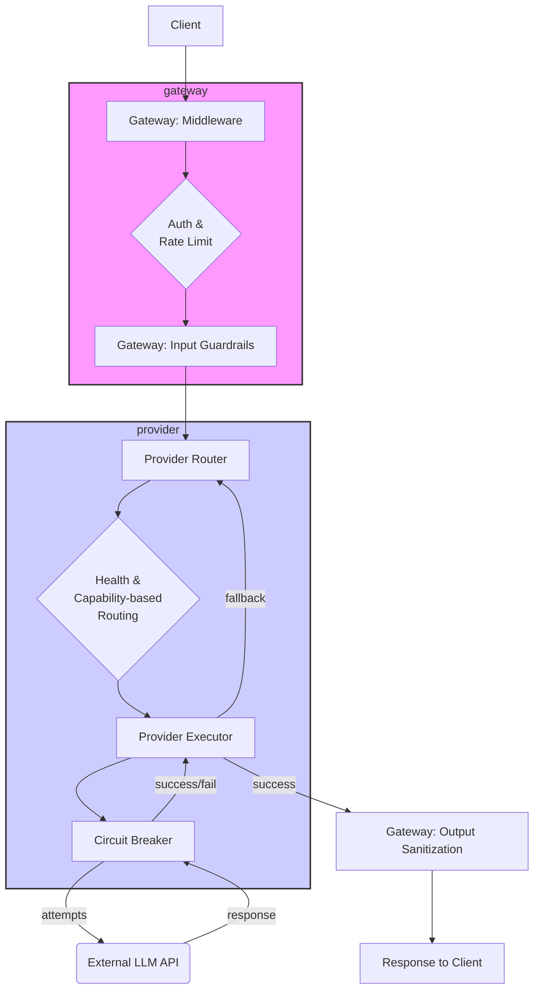

# Project Architecture Overview

This document provides a comprehensive overview of the project's architecture, synthesizing analyses from all core modules within the `src` directory.

## 1. High-Level Architecture & Philosophy

This project is an advanced, asynchronous AI Gateway built on Python and FastAPI. Its architecture is not a simple monolith but rather a well-structured system that embraces principles from Domain-Driven Design (DDD), Clean Architecture, and Resilience Engineering.

**Core Philosophy:**
- **Layered & Decoupled:** The application is divided into distinct, loosely coupled modules (`gateway`, `provider`, `storage`, `event_bus`, etc.), each with a single, clear responsibility.
- **Asynchronous First:** Built entirely on `asyncio`, the system is designed for high concurrency and non-blocking I/O, making it suitable for handling many simultaneous requests and long-running connections (like WebSockets and SSE streams).
- **Configuration over Code:** Key behaviors like provider routing, rate limiting, and feature flags are controlled by external configuration files (`.toml`, `.yaml`), allowing for dynamic adjustments without code changes.
- **Resilience & Fault Tolerance:** The system is explicitly designed to handle failures. Patterns like **Circuit Breaker**, **Retry with Exponential Backoff**, and **Fallback Chains** are first-class citizens, particularly in the `provider` module, ensuring that the failure of one downstream service does not cascade and bring down the entire application.
- **Interface-Driven:** The use of abstract base classes (interfaces) in modules like `storage` and `provider` allows for a pluggable architecture. It's easy to swap out a database (`SQLite` for `Postgres`) or add a new LLM provider without affecting the core business logic.

## 2. High-Level Request Flow

A typical chat request (`/v1/chat/completions`) flows through the system as follows:

1.  **Middleware:** The request is first processed by the FastAPI middleware for observability (logging, tracing) and authentication.
2.  **Guards:** It's then checked by the rate limiter and input guardrails (prompt injection filters).
3.  **Routing:** The `ModelRouter` in the `provider` module selects an ordered chain of LLM providers to try, based on configured rules, health checks (Circuit Breaker status), and requested capabilities.
4.  **Execution:** The `ProviderExecutor` attempts to send the request to the first provider in the chain, wrapping the call in **Retry** and **Circuit Breaker** policies.
5.  **Fallback:** If a provider fails permanently (e.g., all retries fail), the `ModelRouter` attempts the next provider in the chain.
6.  **Response:** Once a provider succeeds, the response is sanitized for sensitive data and streamed back to the client.

---

## 3. Core Module Analysis

### Module: `gateway`
This is the heart of the application, acting as a smart API Gateway. It defines all public-facing endpoints and orchestrates the entire request pipeline.

- **Patterns:** Middleware, Chain of Responsibility, Strategy (for auth, rate limiting), Circuit Breaker (as a client), Facade.
- **Responsibilities:**
    - Defining all API routes using FastAPI routers (`/auth`, `/chat`, `/admin`, etc.).
    - Assembling and ordering the middleware stack (Observability, Auth, CORS).
    - Integrating various services like rate limiting, guardrails, and provider routing into the request lifecycle.
    - Handling the complete server-side logic for authentication flows (OAuth, JWT, API Keys).
    - Managing WebSocket connections for real-time eventing.
- **Key Flow:** A request passes through the middleware stack, is routed to an endpoint, which then calls other services (like the `ModelRouter` or `ContextEngine`) to fulfill the request.

---

### Module: `provider`
This module is responsible for abstracting and communicating with all external LLM providers. It is a prime example of a resilient, pluggable framework.

- **Patterns:** Adapter, Strategy, Factory, Repository, Circuit Breaker, Retry, Fallback.
- **Responsibilities:**
    - Providing a standardized interface (`BaseProvider`) for all providers.
    - Implementing provider-specific **Adapters** to convert the gateway's canonical request/response format to/from the provider's native format.
    - Implementing **Policies** for:
        - **Routing (`RoutingPolicy`):** Deciding which provider(s) to use for a given model, based on YAML rules.
        - **Retrying (`RetryPolicy`):** Intelligently retrying failed requests with exponential backoff.
    - **Orchestration (`ModelRouter`):** Executing the full fallback logic: selecting a provider chain, checking for health, and iterating through it until a request succeeds.
- **Key Flow:** The `ModelRouter` receives a request from the `gateway`. It uses the `RoutingPolicy` to get a list of providers. It then uses the `ProviderExecutor` to try each provider in sequence, with the executor itself applying Retry and Circuit Breaker logic for each attempt.

---

### Module: `storage`
This module is a clean, layered data persistence framework responsible for all database and cache interactions.

- **Patterns:** Repository, Unit of Work, Strategy/Bridge, Facade, Event-Driven Integration.
- **Responsibilities:**
    - Defining abstract interfaces for different storage types (`DatabaseDriver`, `CacheDriver`, `VectorDriver`).
    - Providing concrete driver implementations (`SQLiteDriver`, `RedisDriver`).
    - Encapsulating all query logic within **Repositories** (`UserRepository`, `ProjectRepository`).
    - Ensuring data integrity and transactional atomicity for SQL operations via the **Unit of Work** pattern (`SqlAlchemyUnitOfWork`).
    - Automatically generating and publishing events (e.g., `storage.user.created`) after a successful database commit.
- **Key Flow:** Services needing database access use a `UnitOfWork`. They get repositories from the `uow` instance, perform business logic, and call `uow.commit()`. The UoW ensures all operations are part of a single transaction.

---

### Module: `event_bus`
This module provides a highly reliable, asynchronous publish/subscribe system for decoupled communication between services.

- **Patterns:** Publish/Subscribe, Mediator, Dependency Injection, Idempotency, Dead Letter Queue (DLQ).
- **Responsibilities:**
    - Allowing any part of the system to `publish` an event.
    - Dispatching events to registered `subscribers` from a priority queue.
    - Providing enterprise-grade reliability features:
        - **DI:** Automatically injects dependencies like repositories into event handlers.
        - **Automatic UoW:** Wraps database-accessing handlers in a Unit of Work.
        - **Retries:** Automatically retries failed handlers.
        - **DLQ:** Sends permanently failed events to a dead-letter queue for later inspection.
        - **Idempotency:** Prevents duplicate processing of the same event.
- **Key Flow:** A service calls `bus.publish(event)`. The `EventDispatcher` (a background task) picks up the event, resolves handlers and their dependencies, and executes them with the appropriate reliability policies.

---

### Module: `schemas`
This is the data dictionary or "Shared Kernel" of the application, defining all data contracts using Pydantic models.

- **Patterns:** Data Transfer Object (DTO), Canonical Data Model.
- **Responsibilities:**
    - Providing a single source of truth for the structure of all data moving through the system.
    - Defining the provider-agnostic, canonical format for objects like `GatewayChatRequest`, `GatewayResponse`, and `GatewayMessage`.
    - Ensuring all data is validated at module boundaries.

---

### Module: `runtime`
This module lays the foundation for a sophisticated, distributed, stateful execution environment, likely for future agentic or long-running tasks. It is architecturally distinct from the stateless `gateway`.

- **Patterns:** Actor Model, Event Sourcing, Distributed Lock, Consistent Hashing.
- **Responsibilities:**
    - Managing the lifecycle of `SessionActor`s, where each actor encapsulates the state for a single user session.
    - Ensuring only one server instance can control a given session at a time using a `DistributedSessionLock` (on Redis).
    - Routing session-specific requests (e.g., on a WebSocket) to the correct server instance using `ConsistentHashing`.
    - Persisting a full, immutable history of all state changes as a log of events via the `EventStore` (Event Sourcing).

---

### Minor Modules

- **`config`:** A robust, layered configuration system that loads settings from YAML, `.env` files, and environment variables, using Pydantic for validation.
- **`context`:** A service responsible for loading all necessary data (user info, project files, message history) to create a `ContextObject` for a session.
- **`tool`:** A pluggable framework for defining and executing tools (function calling), with support for local functions, remote servers (MCP), and multi-step workflows.
- **`agent`:** A simple registry for managing the definitions of different agents the system can use.
