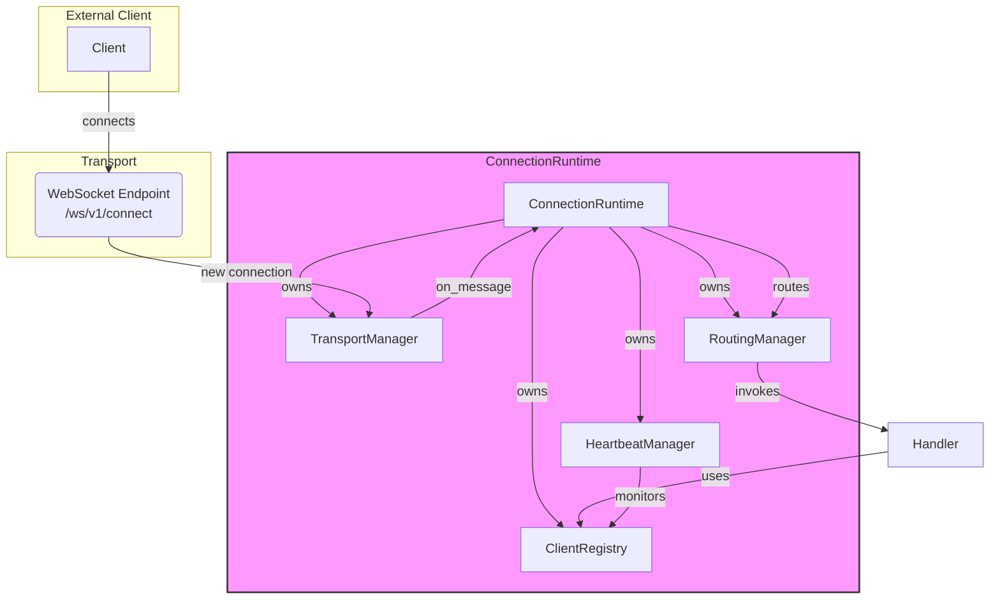

# Connection Runtime Module

**Version:** 1.0
**Owner:** `ConnectionRuntime`

---

## 1. Purpose

The Connection Runtime is the primary entry point for all external clients (Desktop, CLI, Browser) into the AI Runtime Backend. Its sole responsibility is to manage the lifecycle of these connections, from the initial handshake to the final disconnection, without any knowledge of the business logic (Tools, Context, Providers) being executed.

It establishes a persistent, stateful communication channel, typically over WebSockets.

## 2. Architecture & Design

The module is built around the central `ConnectionRuntime` class, which orchestrates several specialized components, following the Single Responsibility Principle.



### Component Breakdown

- **`ConnectionRuntime` (`connection_runtime.py`):** The main orchestrator. It owns all other components and wires them together. It implements the standard `Runtime` lifecycle (`initialize`, `start`, `stop`).

- **`TransportManager` (`transport.py`):** Manages the low-level transport protocol. It creates the FastAPI WebSocket endpoint (`/ws/v1/connect`) and passes lifecycle events (connect, disconnect, message) to the `ConnectionRuntime` via callbacks.

- **`RoutingManager` (`routing.py`):** A clean, scalable message router. It maintains a registry of message types (e.g., "REGISTER", "HEARTBEAT") and their corresponding handler functions. This decouples the `ConnectionRuntime` from the specifics of message handling.

- **`ClientRegistry` (`client_registry.py`):** The source of truth for connected clients. It's a simple in-memory database that stores `ClientInfo` objects, tracking their ID, type, address, and heartbeat status.

- **`HeartbeatManager` (`heartbeat.py`):** A background service that periodically checks the `ClientRegistry` for stale clients (those that haven't sent a heartbeat in a while) and deregisters them to prevent resource leaks.

## 3. Key Flows

### Client Registration Flow

1.  **Client** connects to `ws://.../ws/v1/connect`.
2.  **`TransportManager`** accepts the connection and notifies `ConnectionRuntime`.
3.  **Client** sends a JSON message: `{ "type": "REGISTER", "payload": { "client_type": "desktop" } }`.
4.  **`TransportManager`** passes the message to `ConnectionRuntime`'s `_handle_message` method.
5.  **`_handle_message`** delegates to `RoutingManager.route()`.
6.  **`RoutingManager`** finds the handler for "REGISTER" (`_handle_register_message`).
7.  **`_handle_register_message`** creates a `ClientInfo` object, adds it to the `ClientRegistry`, and sends a `REGISTER_ACK` back to the client.

### Heartbeat Flow

1.  **Client** periodically sends a `{ "type": "HEARTBEAT", "payload": { "client_id": "..." } }` message.
2.  The message is routed via `RoutingManager` to `_handle_heartbeat_message`.
3.  **`_handle_heartbeat_message`** calls `client_registry.update_heartbeat()` to update the client's `last_heartbeat` timestamp.
4.  Separately, **`HeartbeatManager`** runs a background task. If `time.time() - client.last_heartbeat > timeout`, it calls `client_registry.deregister()` to remove the stale client.

## 4. How to Extend

To add a new message type (e.g., `CAPABILITY_REQUEST`):
1.  Add a new handler method to `ConnectionRuntime`, e.g., `_handle_capability_request(...)`.
2.  Register the handler in `ConnectionRuntime.initialize()`:
    ```python
    self.routing_manager.register("CAPABILITY_REQUEST", self._handle_capability_request)
    ```
3.  Implement the logic in the new handler. This logic will typically involve publishing an event to the main `EventBus` for other runtimes to consume, thus respecting the architectural principle of event-driven communication.
