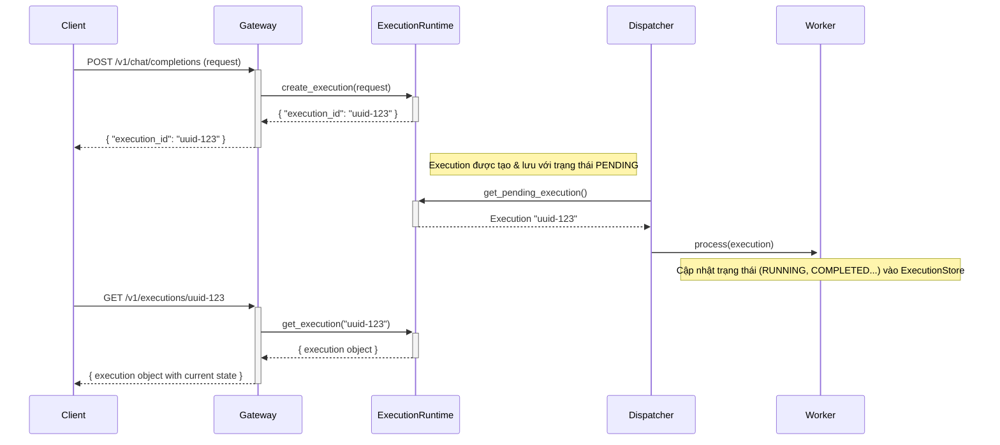

# Execution Runtime Module

---

## 1. Giới thiệu & Mục tiêu

Module này là trái tim của **Phase 3 - Execution Layer** trong lộ trình chuyển đổi kiến trúc. Mục tiêu cốt lõi là chuyển đổi mô hình xử lý request từ Stateless (gửi và đợi) sang **Execution-centric** (gửi và quản lý).

Mỗi yêu cầu từ người dùng không còn là một lời gọi API tạm thời, mà được định danh là một đối tượng `Execution` có trạng thái, có vòng đời, và có thể được quản lý, theo dõi, hoặc hủy bỏ một cách độc lập. Điều này cho phép một `Session` có thể quản lý đồng thời nhiều luồng thực thi (ví dụ: một luồng đang sinh code, một luồng đang chạy phân tích, và một luồng đang chờ người dùng nhập liệu).

## 2. Các thành phần chính

-   **`Execution` (Schema):** Một đối tượng Pydantic định nghĩa "hợp đồng" cho một lượt thực thi. Nó chứa toàn bộ thông tin để có thể tái tạo và tiếp tục một tác vụ.
    -   `execution_id`: (UUID) Định danh duy nhất cho lượt thực thi.
    -   `session_id`: Định danh session cha.
    -   `workflow_id`: (Tùy chọn) Định danh workflow đang được thực thi.
    -   `state`: Trạng thái hiện tại của execution (`PENDING`, `RUNNING`, `PAUSED`, `COMPLETED`, `FAILED`, `CANCELLED`).
    -   `context`: Ngữ cảnh đầu vào của lượt thực thi (request ban đầu, cấu hình...).
    -   `history`: Lịch sử các bước đã thực thi và kết quả.
    -   `policies`: Các chính sách áp dụng (timeout, retry, cancellation).

-   **`ExecutionRuntime` (Service):** Dịch vụ trung tâm chịu trách nhiệm quản lý toàn bộ vòng đời của các `Execution`. Nó không thực thi logic nghiệp vụ trực tiếp, mà điều phối (orchestrate) các tác nhân khác.

-   **`ExecutionStore` (Persistence):** Lớp chịu trách nhiệm lưu trữ và truy xuất trạng thái của các `Execution` từ một hệ thống lưu trữ bền vững (ví dụ: Redis hoặc cơ sở dữ liệu SQL, tích hợp qua module `storage`).

## 3. Trách nhiệm của ExecutionRuntime

`ExecutionRuntime` cung cấp các giao diện (API) để quản lý vòng đời của một `Execution`:

-   **`create_execution(request) -> Execution`**:
    -   Nhận một yêu cầu (ví dụ: `ChatRequest`).
    -   Chuyển đổi nó thành một đối tượng `Execution` mới.
    -   Gán `execution_id` và đặt trạng thái là `PENDING`.
    -   Lưu `Execution` vào `ExecutionStore`.
    -   Đưa `Execution` vào hàng đợi để `ExecutionDispatcher` xử lý.
    -   Trả về đối tượng `Execution` vừa tạo (hoặc chỉ `execution_id`).

-   **`cancel_execution(execution_id)`**:
    -   Tìm `Execution` trong `ExecutionStore`.
    -   Đánh dấu trạng thái là `CANCELLED`.
    -   Gửi tín hiệu (event) để yêu cầu dừng tác vụ đang chạy.

-   **`get_execution(execution_id) -> Execution`**:
    -   Truy xuất thông tin chi tiết của một `Execution` từ `ExecutionStore`.

-   **`list_executions(session_id) -> List[Execution]`**:
    -   Liệt kê tất cả các `Execution` thuộc về một `Session`.

## 4. Luồng hoạt động (Sequence Flow)

Luồng xử lý mới sẽ đi theo mô hình sau:

