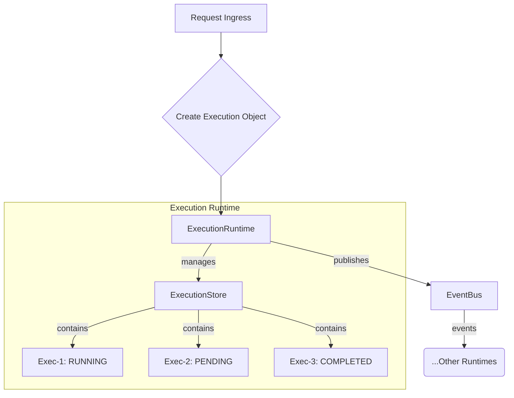

# Execution Runtime Module

**Version:** 1.0
**Owner:** `ExecutionRuntime`

---

## 1. Purpose

The Execution Runtime is a core component of the AI Runtime Backend, responsible for transforming the system from a stateless request-response model to a stateful, "execution-centric" architecture.

Its primary purpose is to manage the lifecycle of **Executions**. An Execution is a first-class object representing a single, trackable instance of a task, workflow, or chat session.

## 2. Architecture & Design

This runtime introduces the `Execution` object as a central concept. Instead of processing a `Chat Request` directly, the system will now create an `Execution` object and manage its state through this runtime.

### Component Breakdown

- **`ExecutionRuntime` (`execution_runtime.py`):** The main orchestrator class. It will expose an API (likely via the EventBus) to create, cancel, pause, and resume executions. It manages the `ExecutionStore`.

- **`ExecutionStore` (`execution_store.py`):** An in-memory repository for all active `Execution` objects. It provides simple CRUD-like operations to manage the collection of executions. For persistence, it will likely interact with a Storage Runtime in the future.

- **`Execution` (`schemas/execution.py`):** The Pydantic data model that defines the structure of an execution, including its ID, state (`PENDING`, `RUNNING`, `COMPLETED`, etc.), context, and results.

## 3. Key Responsibilities & Benefits

- **Stateful Management:** Tracks the state of every task, allowing for long-running operations that would time out in a normal HTTP request.
- **Observability:** Centralizes the state of all active tasks, making it easy to monitor what the system is doing at any given moment.
- **Controllability:** By exposing controls for `pause`, `resume`, and `cancel` on an `Execution` object, it gives users and other systems fine-grained control over running tasks.
- **Concurrency:** A single user session can have multiple concurrent executions, enabling more complex and parallel interactions.
- **Decoupling:** It decouples the "request" from the "work". The `ConnectionRuntime` can accept a request, create an `Execution`, and return an `execution_id` immediately. The client can then use this ID to query the status or get the result later, fitting perfectly with asynchronous workflows.

## 4. Next Steps

- Implement the logic within `ExecutionRuntime` to create and manage executions.
- Define events (e.g., `EXECUTION_CREATED`, `EXECUTION_COMPLETED`) to be published to the `EventBus`.
- Integrate the `ExecutionStore` into the `ExecutionRuntime`'s lifecycle.
- Refactor existing request flows (like the main chat flow) to create and use `Execution` objects instead of being processed directly.
